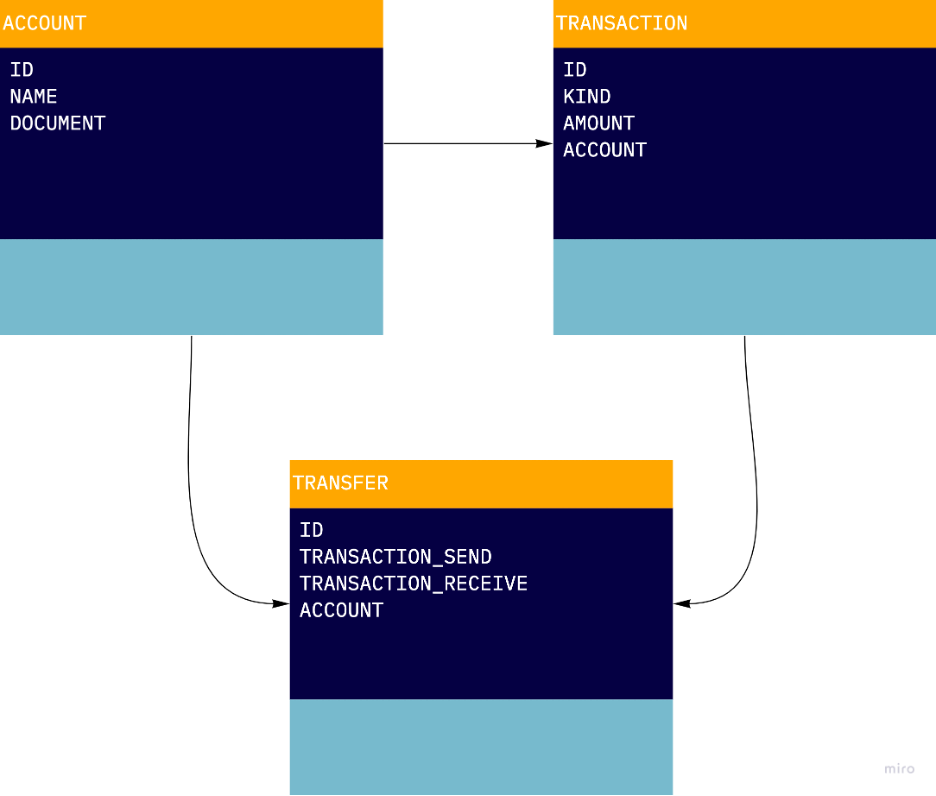

# Wallet

### Stack
* Ruby 3.1.1
* Rails 7.0.2.2
* Postgre 13.6

### How To Run
```
bin/rails server -e development -p 3000
```

### Why RoR
* Productivity
* Active Record is awesome
* Convention over configuration
* Don't need to install a bunch of library

### Architecture
I chose to use [hexagonal architecture](https://netflixtechblog.com/ready-for-changes-with-hexagonal-architecture-b315ec967749), or something like this. The project is too tiny to explore all the architecture components.

I designed the entities in the following way:



* **Account** - Represents a user account. The id and document are identifiers.
* **Transaction** - Represents all the transactions done by the users (deposit or withdraw). The id is the identifier.
* **Transfer** - Represents a transfer did between two users, based on the transactions. The id is the identifier.

### Misc
[Postman Collection](https://www.getpostman.com/collections/389d607d903b6a122e0d)
